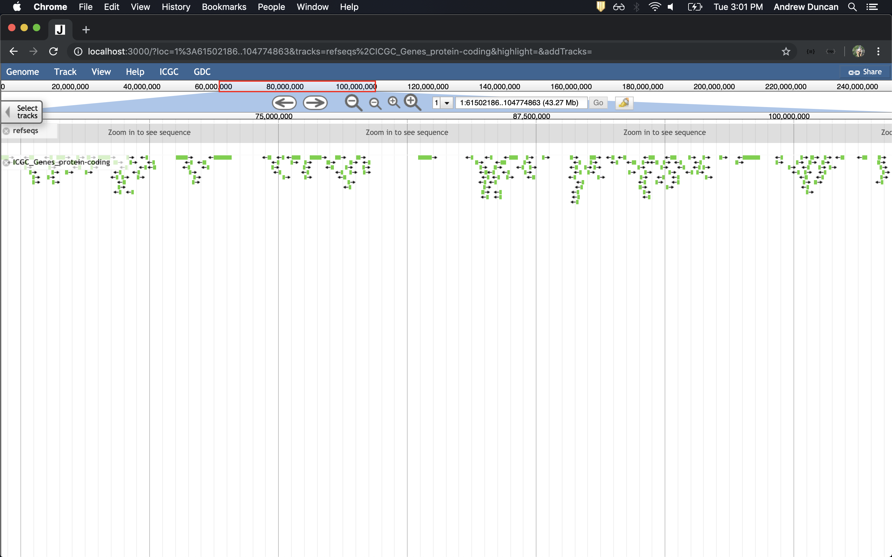
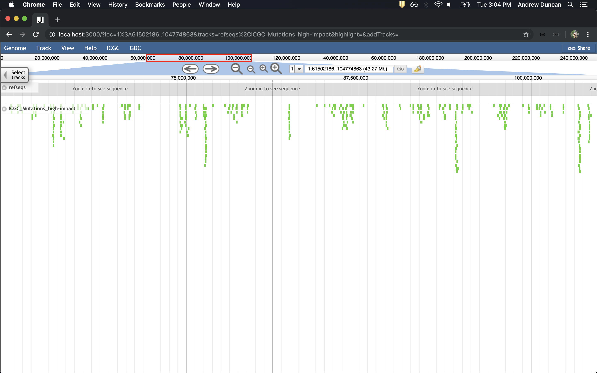
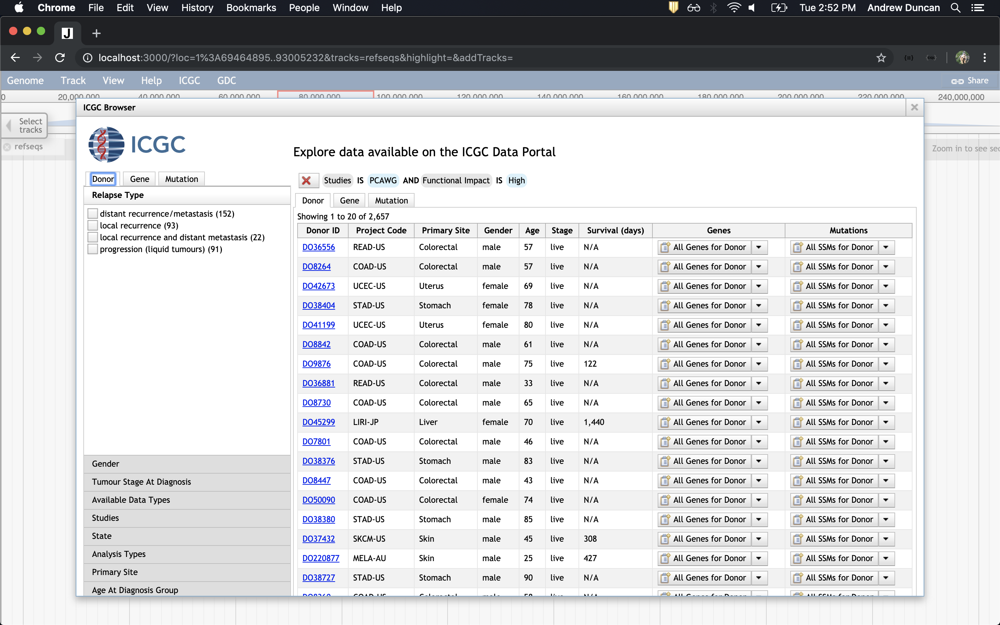
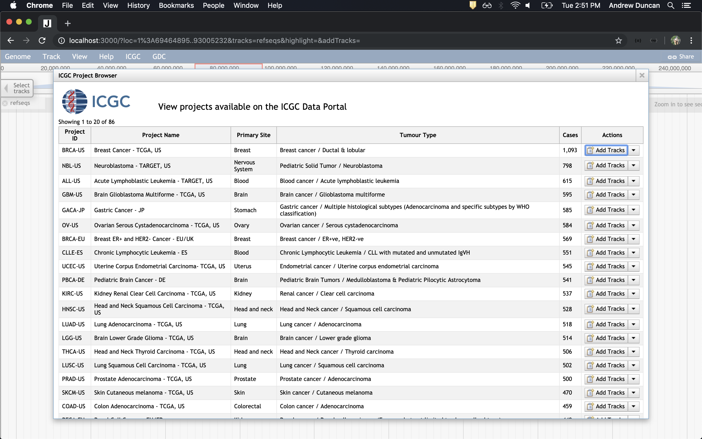

[](https://travis-ci.org/agduncan94/icgc-viewer)
# ICGC JBrowse Plugin
A plugin for [JBrowse](https://jbrowse.org/) for viewing [ICGC](https://icgc.org/) data. For any bugs, issues, or feature recommendations please create an issue through GitHub.

# Installation and Setup
## 1. Install JBrowse
Quick setup of JBrowse - https://github.com/GMOD/jbrowse/#install-jbrowse-from-github-for-developers

## 2. Install Plugin
See [JBrowse - Installing Plugins](https://jbrowse.org/docs/plugins.html) for a general approach to installing plugins.

For installing icgc-viewer plugin:
1) Copy the icgc-viewer folder into the JBrowse `plugins` directory.
2) Add 'icgc-viewer' to the array of plugins in the `jbrowse_conf.json`.

## 3. Install Reference Sequence Data
Now setup the reference sequence used. ICGC requires the GRCh37 Human reference files.

Download the GRCh37 `.fa` and `.fa.fai` files online (ex. http://bioinfo.hpc.cam.ac.uk/downloads/datasets/fasta/grch37/). Then put the following in `./data/tracks.conf` (note files may be named something else).

```
refSeqs=GRCh37.genome.fa.fai
  
[tracks.refseqs]
urlTemplate=GRCh37.genome.fa
```

## 4. Adding new tracks
We have some basic example tracks in `data/tracks.conf`. You can also add new tracks by using the ICGC Dialog accessible within JBrowse. These are present in the menu under `ICGC`. See [Dynamic Track Generation](#dynamic-track-generation) for more details.

## 5. Run JBrowse
You'll have to run the following commands:

```
./setup.sh
utils/jb_run.js -p 3000
```

JBrowse should now be running with the ICGC Plugin working!

# JBrowse configuration
## Faceted Track Selector
Add the following to your jbrowse.conf to use the faceted track selector.
```
[trackSelector]
type = Faceted
displayColumns =
  + label
  + key
  + datatype
  + donor
  + project
```

# Available Store SeqFeature
## A note on filters
All SeqFeatures support filters as they are used in the ICGC API Documentation.

You can view/edit the filters associated with a track by clicking the down arrow for the track menu and selecting `View Applied Filters`. Be careful, there are currently no checks to see if the filters are valid before applying them.

## Genes
A simple view of all genes returned by the ICGC portal for a given range of the chromosome you are looking at.

If you specify a donor ID (donor field) in the track config file, only genes related to that donor will appear.
```
donor: DO229446
```

You can also use the filters field to pass filters to be applied to the track. The expected input is a filter object like the following:

```
{
    "gene" : {
        "type": {
            "is": [
                "protein_coding"
            ]
        }
    }
}
```

To put it in the track config file you may want to minimize it as such:
```
filters={"gene":{"type":{"is":["protein_coding"]}}}
```

Example Track:
```
[tracks.ICGC_Genes_protein-coding]
storeClass=icgc-viewer/Store/SeqFeature/Genes
type=icgc-viewer/View/Track/GeneTrack
key=ICGC_Genes_protein-coding
unsafePopup=true
filters={"gene":{"type":{"is":["protein_coding"]}}}
```



### Extra notes
You can also set the `size` attribute (defaults to 1000). This is the theoretical maximum number of genes displayed at a time in JBrowse (per panel). The smaller the value, the faster JBrowse will be.

## SimpleSomaticMutations
A simple view of all the simple somatic mutations across all donors in the ICGC portal. 

If you specify a donor ID (donor field) in the track config file, only mutations related to the given donor will be shown (if the donor exists).
```
donor: DO229446
```

You can also use the filters field to pass filters to be applied to the track. The expected input is a filter object like the following:

```
{
    "mutation" : {
        "functionalImpact": {
            "is": [
                "High"
            ]
        }
    }
}
```

To put it in the track config file you may want to minimize it as such:
```
filters={"mutation":{"functionalImpact":{"is":["High"]}}}
```

Example Track:
```
[tracks.ICGC_Mutations_high-impact]
storeClass=icgc-viewer/Store/SeqFeature/SimpleSomaticMutations
type=icgc-viewer/View/Track/SSMTrack
key=ICGC_Mutations_high-impact
unsafePopup=true
filters={"mutation":{"functionalImpact":{"is":["High"]}}}
```



### Extra notes
You can also set the `size` attribute (defaults to 500). This is the theoretical maximum number of mutations displayed at a time in JBrowse(per panel). The smaller the value, the faster JBrowse will be.

# Dynamic track generation
## Explore donors, genes and mutations
In the menubar there is an ICGC button with an option to `Explore donors, genes and mutations`. This will bring up a dialog similar to the [advanced search page](https://dcc.icgc.org/search) on the ICGC portal. Here you can apply facets related to donor, gene and mutation. You can then create tracks based on the chosen facets.



## Explore projects
There is also an options to search ICGC by projects. This allows you to see all of the associated SSMs and Genes per project in one track. If you want to apply additional facets to a project, you'll need to use the `Explore donors, genes and mutations` dialog.


# Export Types
The following export types are supported by both Genes and SSMs. To export, select `Save track data` in the track dropdown. Note that not all track information is carried over to the exported file.
* BED
* GFF3
* Sequin Table
* CSV
* Track Config

# Miscellaneous
## Advanced Usage of Tracks
You do not need to add tracks directly from the ICGC Dialog. You can also define them in the `tracks.conf` file.

See `data/advanced-tracks.conf` for some more complex usages, including filters.

# Automated testing
Cypress.io is used for testing this plugin. The following steps show how to run the tests locally.
1. Install JBrowse and but don't install chromosome files.
2. Download Chr 1 fasta from `http://ftp.ensembl.org/pub/release-75/fasta/homo_sapiens/dna/Homo_sapiens.GRCh37.75.dna.chromosome.1.fa.gz`. There should be the fasta index file in `cypress/data/Homo_sapiens.GRCh37.75.dna.chromosome.1.fa.fai`. Put these files into `jbrowse/data/`.
3. Install Cypress.io with `npm install`.
4. Place `cypress/data/tracks.conf` into your `jbrowse/data/` directory. Make sure no other tracks are present.
5. Run `npx cypress open` or `npx cypress run` or `npm run e2e`

**Note** while some tests have mocked endpoints, not all endpoints are mocked. This could lead to breakage of tests in the future.